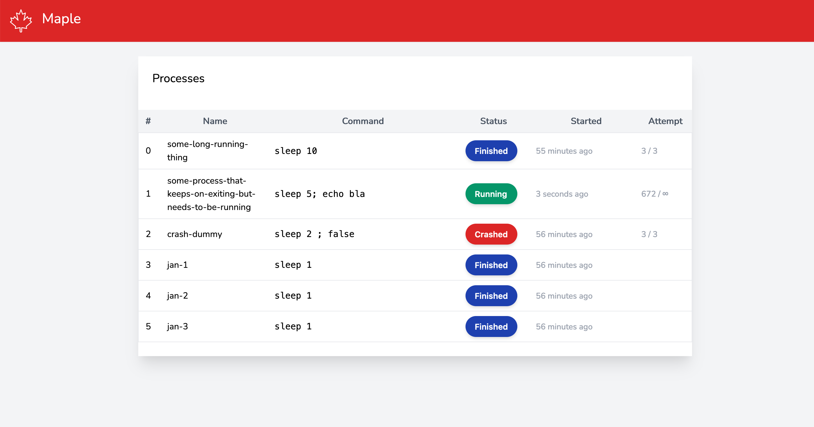

<p align="center">
    
</p>

# Welcome to Maple!

Maple providers the task runner you always wanted but never dared to ask for. 

### Notice for production usage
Maple is current in active development (say beta state) production use can be done if you're one of the brave (if you are please let me know how you like it in production!) 

## Installation per project  

Just your regular dependency should do the trick!

`composer require xantios/maple`

After running composer add a `maple-config.php` to the work directory of your project and run:

`vendor/bin/maple`

## Global installation

If you use Maple a lot, maybe install it globally.
`composer global require xantios/maple` should do the trick! 

when you run the maple command make sure there is a config in your current directory.

## Configuration

The configuration file is a plain PHP array, it is pretty self-explanatory

```php
<?php

return [
    // Host to listen on (defaults to 127.0.0.1)
    # 'host' => '0.0.0.0',

    // Port for web interface to listen on (defaults to 8100)
    # 'port' => 8100,
    
    // Verbose logging
    'verbose' => true,
    
    // Tasks available 
    'tasks' => [
        [
            'name' => "Run webpack",
            'retries' => 0,
            'autostart' => true,
            'cmd' => 'npm run dev'
        ],
        [
            'name' => "Some process that keeps on exiting but needs to be running",
            'retries' => -1,
            'autostart' => true,
            'cmd' => 'ping -t 3 8.8.8.8 ; sleep 5'
        ],
        // Run multiple tasks back-to-back 
        [
            'name' => 'Jan-1',
            'after' => 'Jan-2',
            'autostart' => true,
            'cmd' => 'sleep 1',
        ],
        [
            'name' => 'Jan-2',
            'after' => 'Jan-3',
            'cmd' => 'sleep 1',
        ],
        [
            'name' => 'Jan-3',
            'after' => '',
            'cmd' => 'sleep 1',
        ]
    ]
];
```

## Webinterface

There is a dashboard available at `http://localhost:8100` that looks something like this:



## Contributing in code

Thank you for considering contributing, feel free to PR anything you like or create an issue if you think you have a great idea!

## Contributing in other means

Thank you emails, donations, photos of how your life changed by a piece of software and bags of coffee beans are welcome at <git@xantios.nl>

## Security Vulnerabilities

If you discover a security vulnerability within Maple, please send an e-mail to Xantios Krugor <git@xantios.nl> All security vulnerabilities will be promptly addressed.

## License

Maple is open-sourced software licensed under the [MIT license](https://opensource.org/licenses/MIT).
